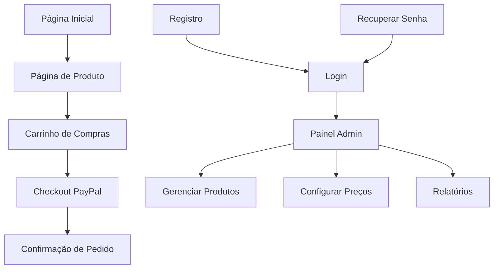

# Sistema de E-commerce Profissional - Documento de Requisitos

## 1. Visão Geral do Produto

Sistema de e-commerce profissional com interface moderna e integração completa com PayPal para processamento de pagamentos. A plataforma oferece experiência de compra intuitiva para clientes e ferramentas robustas de gerenciamento para administradores.

O produto resolve a necessidade de pequenas e médias empresas terem uma plataforma de vendas online profissional, com foco em conversão e facilidade de uso tanto para compradores quanto para gestores.

Objetivo: Criar uma solução completa de e-commerce que combine tecnologias modernas (Django + FastAPI) com design responsivo e integração segura de pagamentos.

## 2. Funcionalidades Principais

### 2.1 Papéis de Usuário

| Papel | Método de Registro | Permissões Principais |
|-------|-------------------|----------------------|
| Cliente | Registro por email | Navegar produtos, adicionar ao carrinho, finalizar compras |
| Administrador | Criado por superadmin | Gerenciar produtos, preços, visualizar pedidos |
| Superadministrador | Acesso direto ao sistema | Controle total: usuários, produtos, configurações, moedas |

### 2.2 Módulos de Funcionalidade

Nosso sistema de e-commerce consiste nas seguintes páginas principais:

1. **Página Inicial**: seção hero, navegação principal, catálogo de produtos em destaque, filtros de categoria
2. **Página de Produto**: detalhes do produto, galeria de imagens, botão adicionar ao carrinho, avaliações
3. **Carrinho de Compras**: lista de itens, cálculo de totais, opções de quantidade, botão checkout
4. **Checkout PayPal**: integração com API PayPal, seleção de endereço, confirmação de pedido
5. **Autenticação**: páginas de login, registro, recuperação de senha
6. **Perfil do Cliente**: histórico de pedidos, dados pessoais, endereços salvos
7. **Painel Administrativo**: dashboard, gerenciamento de produtos, controle de preços, configurações

### 2.3 Detalhes das Páginas

| Nome da Página | Nome do Módulo | Descrição da Funcionalidade |
|----------------|----------------|-----------------------------|
| Página Inicial | Seção Hero | Exibir banner promocional rotativo, navegação por categorias, produtos em destaque |
| Página Inicial | Catálogo de Produtos | Listar produtos com filtros por categoria, preço e disponibilidade. Paginação |
| Página de Produto | Detalhes do Produto | Mostrar informações completas, galeria de imagens, opções de variação, botão comprar |
| Carrinho de Compras | Gerenciamento de Itens | Adicionar/remover produtos, alterar quantidades, calcular subtotais e total geral |
| Checkout PayPal | Processamento de Pagamento | Integrar API PayPal, validar dados, processar transação, confirmar pedido |
| Autenticação | Sistema de Login | Autenticar usuários, validar credenciais, gerenciar sessões |
| Autenticação | Registro de Usuário | Criar conta com email/senha, validação de dados, envio de confirmação |
| Autenticação | Recuperação de Senha | Enviar link de reset por email, validar token, permitir redefinição |
| Perfil do Cliente | Dados Pessoais | Editar informações do usuário, gerenciar endereços, visualizar histórico |
| Painel Admin | Dashboard | Exibir métricas de vendas, produtos mais vendidos, relatórios gerenciais |
| Painel Admin | Gerenciamento de Produtos | Criar/editar/excluir produtos, upload de imagens, controle de estoque |
| Painel Admin | Configurações de Moeda | Selecionar moeda padrão (USD, JPY, R$), definir taxas de conversão |

## 3. Processo Principal

### Fluxo do Cliente
1. Cliente acessa a página inicial e navega pelos produtos
2. Seleciona produto de interesse e visualiza detalhes
3. Adiciona produto ao carrinho de compras
4. Acessa carrinho, revisa itens e quantidades
5. Procede para checkout e realiza pagamento via PayPal
6. Recebe confirmação do pedido por email

### Fluxo do Administrador
1. Admin faz login no painel administrativo
2. Acessa dashboard com métricas de vendas
3. Gerencia produtos: adiciona novos, edita existentes, faz upload de imagens
4. Configura preços e seleciona moeda de operação
5. Monitora pedidos e status de pagamento

## 4. Design da Interface do Usuário

### 4.1 Estilo de Design

- **Cores Primárias**: #2563eb (azul moderno), #1e40af (azul escuro)
- **Cores Secundárias**: #f8fafc (cinza claro), #64748b (cinza médio)
- **Estilo de Botões**: Bordas arredondadas (8px), efeitos hover suaves, sombras sutis
- **Tipografia**: Inter ou Roboto, tamanhos 14px (corpo), 18px (subtítulos), 24px+ (títulos)
- **Layout**: Design baseado em cards, navegação superior fixa, sidebar para filtros
- **Ícones**: Lucide React ou Heroicons, estilo outline para consistência

### 4.2 Visão Geral do Design das Páginas

| Nome da Página | Nome do Módulo | Elementos de UI |
|----------------|----------------|----------------|
| Página Inicial | Seção Hero | Banner full-width com gradiente azul, CTA destacado, animação fade-in |
| Página Inicial | Grid de Produtos | Layout responsivo 4-3-2-1 colunas, cards com hover elevation, preços destacados |
| Página de Produto | Galeria de Imagens | Carousel principal + thumbnails, zoom on hover, indicadores de navegação |
| Carrinho | Lista de Itens | Tabela responsiva, botões +/- para quantidade, totais com destaque visual |
| Checkout | Formulário PayPal | Layout em duas colunas, resumo do pedido fixo, botões PayPal oficiais |
| Painel Admin | Dashboard | Cards de métricas, gráficos com Chart.js, tabelas de dados paginadas |
| Painel Admin | Formulário de Produto | Upload drag-and-drop, preview de imagens, validação em tempo real |

### 4.3 Responsividade

Design mobile-first com breakpoints em 640px, 768px, 1024px e 1280px. Otimização para touch em dispositivos móveis com botões de tamanho adequado (44px mínimo) e navegação por gestos.

## 5. Especificações Técnicas

### 5.1 Tecnologias Principais
- **Frontend**: Django Templates + TailwindCSS + Alpine.js
- **Backend**: Django 5.2+ como framework principal
- **APIs**: FastAPI para endpoints específicos de alta performance
- **Banco de Dados**: PostgreSQL (produção) / SQLite (desenvolvimento)
- **Pagamentos**: PayPal REST API v2
- **Autenticação**: Django Auth + JWT para APIs

### 5.2 Integrações Externas
- **PayPal SDK**: Para processamento de pagamentos
- **Email**: SMTP para confirmações e recuperação de senha
- **Storage**: Sistema de arquivos local ou AWS S3 para imagens

### 5.3 Segurança
- Validação CSRF em todos os formulários
- Sanitização de dados de entrada
- Hashing seguro de senhas com bcrypt
- Rate limiting em APIs críticas
- Validação de uploads de imagem