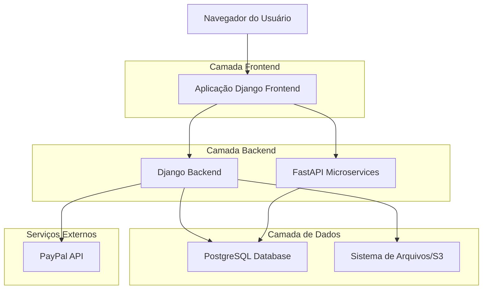
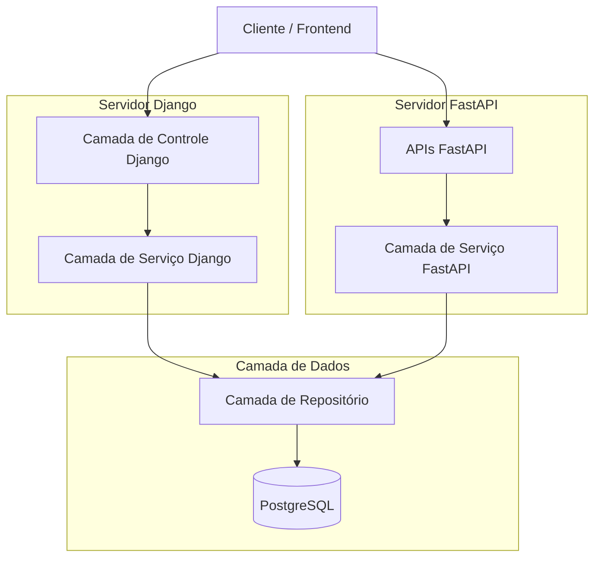
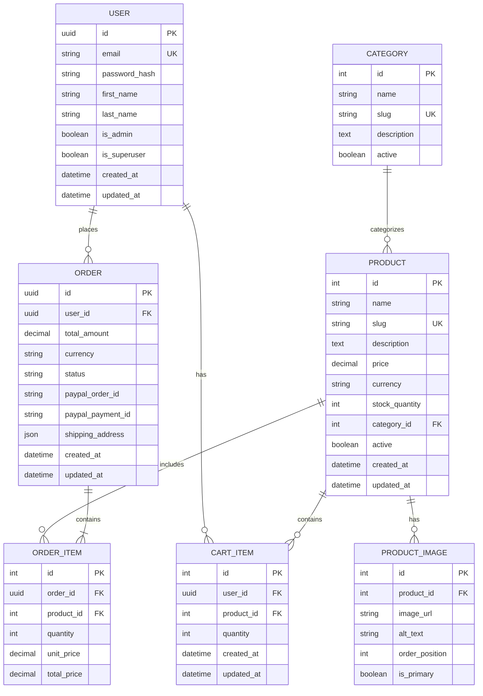

# Arquitetura Técnica - Sistema de E-commerce

## 1. Design da Arquitetura



## 2. Descrição das Tecnologias

- **Frontend**: Django@5.2 + TailwindCSS@3 + Alpine.js@3
- **Backend Principal**: Django@5.2 + Django REST Framework
- **APIs Específicas**: FastAPI@0.116 + Uvicorn
- **Banco de Dados**: PostgreSQL@15 (produção) / SQLite (desenvolvimento)
- **Pagamentos**: PayPal REST SDK@1.13
- **Processamento de Imagens**: Pillow@11.3
- **Autenticação**: Django Auth + JWT

## 3. Definições de Rotas

### 3.1 Rotas Django (Frontend)

| Rota | Propósito |
|------|----------|
| / | Página inicial com catálogo de produtos |
| /produto/<int:id>/ | Página de detalhes do produto |
| /carrinho/ | Visualização e gerenciamento do carrinho |
| /checkout/ | Processo de finalização com PayPal |
| /login/ | Página de autenticação do usuário |
| /registro/ | Página de cadastro de novo usuário |
| /recuperar-senha/ | Página para recuperação de senha |
| /perfil/ | Página do perfil do usuário |
| /admin-panel/ | Dashboard administrativo |
| /admin-panel/produtos/ | Gerenciamento de produtos |
| /admin-panel/pedidos/ | Visualização de pedidos |

### 3.2 Rotas FastAPI (APIs)

| Rota | Propósito |
|------|----------|
| /api/v1/produtos/ | API REST para produtos (CRUD) |
| /api/v1/carrinho/ | API para operações do carrinho |
| /api/v1/pagamentos/ | API para integração PayPal |
| /api/v1/auth/ | API de autenticação e tokens |
| /api/v1/upload/ | API para upload de imagens |

## 4. Definições de API

### 4.1 APIs Principais

#### Autenticação de Usuário
```
POST /api/v1/auth/login
```

Request:
| Nome do Parâmetro | Tipo | Obrigatório | Descrição |
|-------------------|------|-------------|----------|
| email | string | true | Email do usuário |
| password | string | true | Senha do usuário |

Response:
| Nome do Parâmetro | Tipo | Descrição |
|-------------------|------|----------|
| access_token | string | Token JWT para autenticação |
| refresh_token | string | Token para renovação |
| user_id | integer | ID do usuário |

Exemplo:
```json
{
  "email": "usuario@exemplo.com",
  "password": "senha123"
}
```

#### Gerenciamento de Produtos
```
GET /api/v1/produtos/
POST /api/v1/produtos/
PUT /api/v1/produtos/{id}/
DELETE /api/v1/produtos/{id}/
```

Request (POST/PUT):
| Nome do Parâmetro | Tipo | Obrigatório | Descrição |
|-------------------|------|-------------|----------|
| nome | string | true | Nome do produto |
| descricao | string | true | Descrição detalhada |
| preco | decimal | true | Preço do produto |
| moeda | string | true | Moeda (USD, JPY, BRL) |
| categoria_id | integer | true | ID da categoria |
| estoque | integer | true | Quantidade em estoque |
| imagens | array | false | URLs das imagens |

#### Carrinho de Compras
```
POST /api/v1/carrinho/adicionar
PUT /api/v1/carrinho/atualizar
DELETE /api/v1/carrinho/remover/{item_id}
```

#### Processamento PayPal
```
POST /api/v1/pagamentos/criar-pedido
POST /api/v1/pagamentos/capturar-pagamento
```

## 5. Diagrama da Arquitetura do Servidor



## 6. Modelo de Dados

### 6.1 Definição do Modelo de Dados



### 6.2 Linguagem de Definição de Dados (DDL)

#### Tabela de Usuários (users)
```sql
-- Criar tabela de usuários
CREATE TABLE users (
    id UUID PRIMARY KEY DEFAULT gen_random_uuid(),
    email VARCHAR(255) UNIQUE NOT NULL,
    password_hash VARCHAR(255) NOT NULL,
    first_name VARCHAR(100) NOT NULL,
    last_name VARCHAR(100) NOT NULL,
    is_admin BOOLEAN DEFAULT FALSE,
    is_superuser BOOLEAN DEFAULT FALSE,
    created_at TIMESTAMP WITH TIME ZONE DEFAULT NOW(),
    updated_at TIMESTAMP WITH TIME ZONE DEFAULT NOW()
);

-- Criar índices
CREATE INDEX idx_users_email ON users(email);
CREATE INDEX idx_users_created_at ON users(created_at DESC);
```

#### Tabela de Categorias (categories)
```sql
-- Criar tabela de categorias
CREATE TABLE categories (
    id SERIAL PRIMARY KEY,
    name VARCHAR(100) NOT NULL,
    slug VARCHAR(100) UNIQUE NOT NULL,
    description TEXT,
    active BOOLEAN DEFAULT TRUE,
    created_at TIMESTAMP WITH TIME ZONE DEFAULT NOW()
);

-- Dados iniciais
INSERT INTO categories (name, slug, description) VALUES
('Eletrônicos', 'eletronicos', 'Produtos eletrônicos e gadgets'),
('Roupas', 'roupas', 'Vestuário e acessórios'),
('Casa e Jardim', 'casa-jardim', 'Produtos para casa e jardim'),
('Esportes', 'esportes', 'Equipamentos e roupas esportivas');
```

#### Tabela de Produtos (products)
```sql
-- Criar tabela de produtos
CREATE TABLE products (
    id SERIAL PRIMARY KEY,
    name VARCHAR(200) NOT NULL,
    slug VARCHAR(200) UNIQUE NOT NULL,
    description TEXT NOT NULL,
    price DECIMAL(10,2) NOT NULL,
    currency VARCHAR(3) DEFAULT 'BRL' CHECK (currency IN ('USD', 'JPY', 'BRL')),
    stock_quantity INTEGER DEFAULT 0,
    category_id INTEGER REFERENCES categories(id),
    active BOOLEAN DEFAULT TRUE,
    created_at TIMESTAMP WITH TIME ZONE DEFAULT NOW(),
    updated_at TIMESTAMP WITH TIME ZONE DEFAULT NOW()
);

-- Criar índices
CREATE INDEX idx_products_category ON products(category_id);
CREATE INDEX idx_products_active ON products(active);
CREATE INDEX idx_products_price ON products(price);
```

#### Tabela de Imagens de Produtos (product_images)
```sql
-- Criar tabela de imagens
CREATE TABLE product_images (
    id SERIAL PRIMARY KEY,
    product_id INTEGER REFERENCES products(id) ON DELETE CASCADE,
    image_url VARCHAR(500) NOT NULL,
    alt_text VARCHAR(200),
    order_position INTEGER DEFAULT 0,
    is_primary BOOLEAN DEFAULT FALSE
);

-- Criar índices
CREATE INDEX idx_product_images_product ON product_images(product_id);
CREATE INDEX idx_product_images_primary ON product_images(is_primary);
```

#### Tabela de Carrinho (cart_items)
```sql
-- Criar tabela de itens do carrinho
CREATE TABLE cart_items (
    id SERIAL PRIMARY KEY,
    user_id UUID REFERENCES users(id) ON DELETE CASCADE,
    product_id INTEGER REFERENCES products(id) ON DELETE CASCADE,
    quantity INTEGER NOT NULL CHECK (quantity > 0),
    created_at TIMESTAMP WITH TIME ZONE DEFAULT NOW(),
    updated_at TIMESTAMP WITH TIME ZONE DEFAULT NOW(),
    UNIQUE(user_id, product_id)
);

-- Criar índices
CREATE INDEX idx_cart_items_user ON cart_items(user_id);
CREATE INDEX idx_cart_items_product ON cart_items(product_id);
```

#### Tabela de Pedidos (orders)
```sql
-- Criar tabela de pedidos
CREATE TABLE orders (
    id UUID PRIMARY KEY DEFAULT gen_random_uuid(),
    user_id UUID REFERENCES users(id),
    total_amount DECIMAL(10,2) NOT NULL,
    currency VARCHAR(3) DEFAULT 'BRL',
    status VARCHAR(20) DEFAULT 'pending' CHECK (status IN ('pending', 'paid', 'shipped', 'delivered', 'cancelled')),
    paypal_order_id VARCHAR(100),
    paypal_payment_id VARCHAR(100),
    shipping_address JSONB,
    created_at TIMESTAMP WITH TIME ZONE DEFAULT NOW(),
    updated_at TIMESTAMP WITH TIME ZONE DEFAULT NOW()
);

-- Criar índices
CREATE INDEX idx_orders_user ON orders(user_id);
CREATE INDEX idx_orders_status ON orders(status);
CREATE INDEX idx_orders_created_at ON orders(created_at DESC);
CREATE INDEX idx_orders_paypal ON orders(paypal_order_id);
```

#### Tabela de Itens do Pedido (order_items)
```sql
-- Criar tabela de itens do pedido
CREATE TABLE order_items (
    id SERIAL PRIMARY KEY,
    order_id UUID REFERENCES orders(id) ON DELETE CASCADE,
    product_id INTEGER REFERENCES products(id),
    quantity INTEGER NOT NULL,
    unit_price DECIMAL(10,2) NOT NULL,
    total_price DECIMAL(10,2) NOT NULL
);

-- Criar índices
CREATE INDEX idx_order_items_order ON order_items(order_id);
CREATE INDEX idx_order_items_product ON order_items(product_id);
```